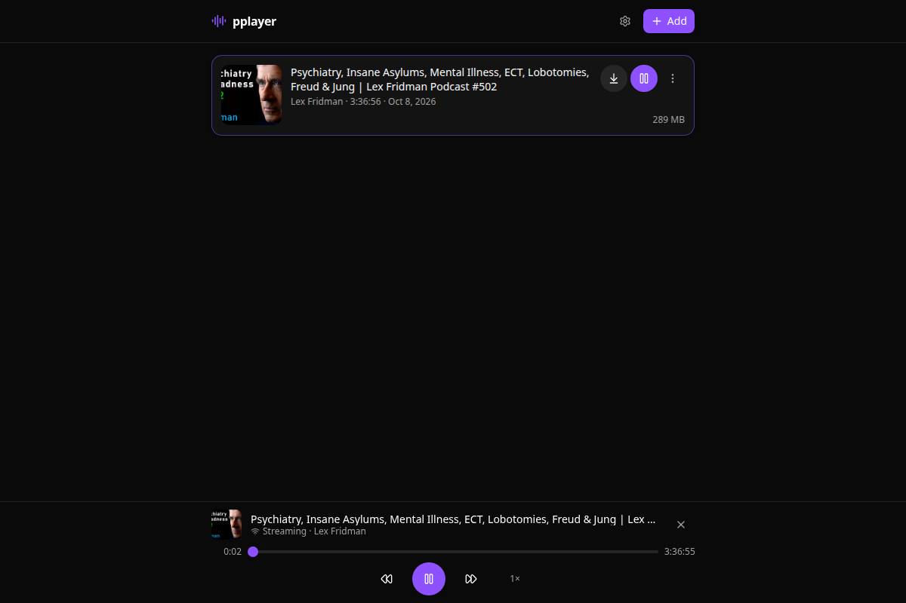
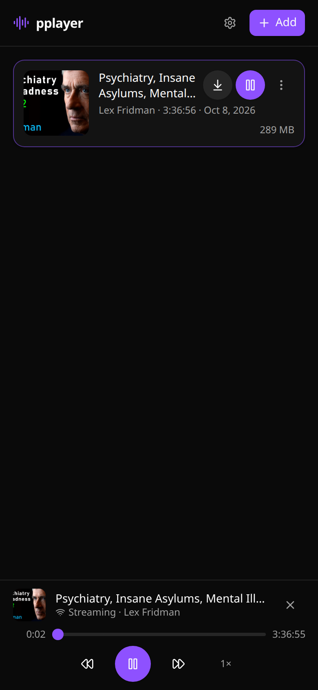

# pplayer

A dead simple podcast downloader and player app

**Desktop**



**Mobile**



## Features

- **YouTube → podcast** — live progress for metadata, download and ffmpeg conversion
- **Player** — seek, ±15/30 s skip, speed, resume, lock-screen controls (Media Session)
- **Offline** — per-episode downloads from the ⋮ menu; audio is stored on the device (IndexedDB) and plays without a connection
- **Library** — cached locally, survives offline reloads; grouped into Continue watching / New / Watched
- **Single API key** — one account, done
- **One Docker image** — frontend, backend, SQLite, yt-dlp and ffmpeg in a single container

## Quick start

```bash
echo "API_KEY=$(openssl rand -hex 16)" > .env
docker compose up -d --build
```

Open <http://localhost:3000> and sign in with the key from `.env`. Data lives in the `pplayer-data` volume.

> Port 3000 taken? `HOST_PORT=8080 docker compose up -d`.
> No `API_KEY`? One is generated into `/data/api-key.txt` and printed in the logs.

## Development

Requires [Bun](https://bun.sh), `yt-dlp` and `ffmpeg` on `PATH`.

```bash
bun install --cwd server && bun install --cwd web
bun run dev:server   # API on :3000
bun run dev:web      # UI on :5173 (proxies /api)
```

## Configuration

| Variable | Default | Description |
| --- | --- | --- |
| `PORT` | `3000` | HTTP port |
| `API_KEY` | generated | Single sign-in key |
| `DATA_DIR` | `server/data` | SQLite DB, audio files, thumbnails |
| `WEB_DIR` | `web/dist` | Built frontend to serve |
| `YTDLP_BIN` / `FFMPEG_BIN` | `yt-dlp` / `ffmpeg` | External tool paths |
| `YTDLP_COOKIES` | — | Netscape `cookies.txt` for YouTube bot checks |
| `LOG_LEVEL` | `info` | `debug`, `info`, `warn` or `error` |

## Logs & troubleshooting

Follow along with `docker compose logs -f pplayer` — every download is logged from start to finish:

```
INFO  [a1b2c3] video: "My episode" by Some Channel (64 min)
INFO  [a1b2c3] downloaded 61.2 MB in 13.1s (source.m4a)
INFO  [a1b2c3] ffmpeg: remuxing (stream copy)
INFO  [a1b2c3] ready: "My episode" (61.2 MB)
```

- `LOG_LEVEL=debug` also logs every request, thumbnail cache and SSE connect
- **YouTube bot check?** Export cookies from a logged-in browser and mount them:

  ```yaml
  environment:
    YTDLP_COOKIES: /cookies.txt
  volumes:
    - ./cookies.txt:/cookies.txt:ro
  ```

- The image installs the latest yt-dlp at build time — rebuild to update it

## API

All routes require the key as `Authorization: Bearer <key>`; media and SSE also accept `?token=` (browser elements can't set headers).

| Method | Route | Purpose |
| --- | --- | --- |
| `POST` | `/api/auth/login` | Validate the key |
| `GET` / `POST` | `/api/episodes` | List episodes / add `{ "url": ... }` |
| `PATCH` / `DELETE` | `/api/episodes/:id` | Save position / delete |
| `POST` | `/api/episodes/:id/retry` | Retry a failed download |
| `GET` | `/api/media/:id` | Stream audio (HTTP Range) |
| `GET` | `/api/thumbnails/:id` | Episode thumbnail |
| `GET` | `/api/events` | SSE: live progress updates |
| `GET` | `/api/health` | Health check (no auth) |

## Layout

```
server/     Bun + Hono API, Drizzle + bun:sqlite, yt-dlp/ffmpeg job queue, SSE
web/        React 19 + Vite + Tailwind v4 + shadcn-style UI, PWA, IndexedDB offline
Dockerfile  multi-stage build; bundles ffmpeg and the latest yt-dlp
```
